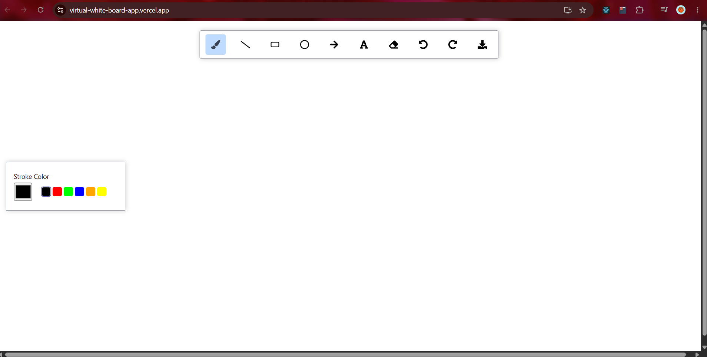
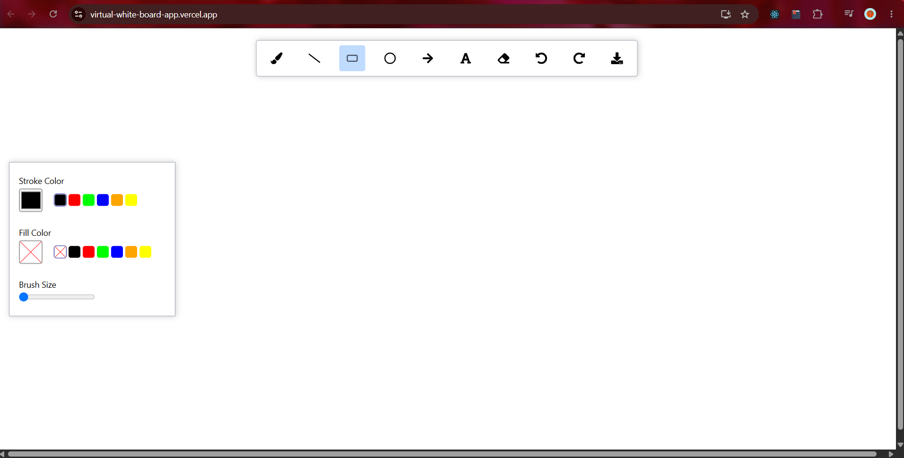

# 🎨 React Whiteboard App

An interactive **Whiteboard Application** built with **React**, **HTML5 Canvas**, and **Rough.js**. It provides a smooth and intuitive drawing experience with support for multiple drawing tools, text editing, customizable colors, adjustable brush sizes, undo/redo history, and canvas export.

---

## 🚀 Live Demo

🌐 **Live Website:** https://virtual-white-board-app.vercel.app/

---
## 📸 Screenshots

### Whiteboard


<table>
  <tr>
    <td align="center">
      <b>Whiteboard-Non Fill Tools</b><br><br>
      
    </td>
    <td align="center">
      <b>Whiteboard-Fill Tools</b><br><br>
      
    </td>
  </tr>
</table>

---

## ✨ Features

*  Freehand Brush Tool
*  Line Tool
*  Rectangle Tool
*  Circle Tool
*  Arrow Tool
*  Text Tool
*  Eraser Tool
*  Custom Stroke Colors
*  Shape Fill Color Support
*  Adjustable Brush Size
*  Adjustable Font Size
*  Undo & Redo Functionality
*  Keyboard Shortcuts (Ctrl + Z / Ctrl + Y) for Undo & Redo
*  Download Canvas as PNG Image
*  Smooth drawing experience using HTML5 Canvas
*  Hand-drawn sketch effect using Rough.js

---
## 💡 Key Concepts Implemented

- Canvas-based drawing system
- Global state management using Context API
- Complex state handling with useReducer
- Undo/Redo using history stacks
- Keyboard shortcuts
- Custom drawing tools
- Dynamic color and brush customization
- Canvas export as PNG
- Immutable state updates

---

## 🛠️ Built With

* React
* JavaScript (ES6+)
* HTML5 Canvas API
*  CSS Modules
*  Tailwind CSS
* Context API
* useReducer
* useContext
* useEffect
* useLayoutEffect
* useRef
* Rough.js
* Perfect Freehand
* Classnames

* Vercel (Deployment)

---

## 📂 Project Structure

```text
.
├── public
├── src
│   ├── components
│   │   ├── Board
│   │   │   ├── index.js
│   │   │   └── index.module.css
│   │   ├── Toolbar
│   │   │   ├── index.js
│   │   │   └── index.module.css
│   │   └── Toolbox
│   │       ├── index.js
│   │       └── index.module.css
│   │
│   ├── store
│   │   ├── BoardProvider.js
│   │   ├── ToolboxProvider.js
│   │   ├── board-context.js
│   │   └── toolbox-context.js
│   │
│   ├── utils
│   │   ├── element.js
│   │   └── math.js
│   │
│   ├── constants.js
│   ├── App.js
│   ├── index.js
│   └── index.css
│
├── package.json
├── package-lock.json
├── tailwind.config.js
└── README.md
```
---

## ⚙️ Installation

Clone the repository

```bash
git clone https://github.com/Panda14325/WhiteBoard-App.git
```

Navigate to the project directory

```bash
cd WhiteBoard-App
```

Install dependencies

```bash
npm install
```

Run the development server

```bash
npm start
```

Open your browser and visit

```
http://localhost:3000
```

---

## 🎯 Learning Objectives

This project was built to strengthen my understanding of:

* React Hooks
* Context API
* useReducer for complex state management
* HTML5 Canvas API
* Interactive drawing applications
* Canvas rendering and optimization
* Mouse event handling
* Undo/Redo implementation using state history
* Implementing keyboard shortcuts using event listeners for Undo and Redo functionality
* Immutable state updates
* Working with third-party libraries

---

## 📚 Libraries Used

* **Rough.js** – Hand-drawn sketch rendering
* **Perfect Freehand** – Smooth freehand brush strokes
* **classnames** – Conditional CSS class management

---

## 🔮 Future Improvements

* Shape selection and movement
* Shape resizing
* Touch and stylus support
* Image upload
* PDF export
* Multi-page whiteboards
* Real-time collaboration
* Autosave support

---

## 🤝 Contributing

Contributions, issues, and feature requests are welcome.

If you'd like to contribute:

1. Fork the repository
2. Create a feature branch
3. Commit your changes
4. Open a Pull Request

---

## 👨‍💻 Author

**Anshuman Singh**

GitHub: https://github.com/Panda14325


---

## ⭐ Show Your Support

If you found this project helpful, please consider giving it a ⭐ on GitHub.

---

## 📄 License

This project is licensed under the MIT License.
